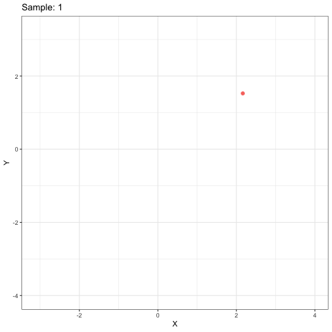

<!-- README.md is generated from README.Rmd. Please edit that file -->

```{r, echo = FALSE}
knitr::opts_chunk$set(
  collapse = TRUE,
  comment = "#>",
  fig.path = "README-"
)
```
[](https://cran.r-project.org/package=SSOSVM)
[](https://travis-ci.org/andrewthomasjones/SSOSVM)
[](https://zenodo.org/badge/latestdoi/112142150)
# SSOSVM

The goal of SSOSVM is to use R to allow batch and online training of soft-margin support vector machines (SVMs). The training of SVMs usually requires that the data be available all at once in a single batch, however the Stochastic majorization-minimization (SMM) algorithm framework allows for the training of SVMs on streamed data instead http://doi.org/10.1007/s42081-018-0001-y. This package utilizes the SMM framework to provide functions for training SVMs with hinge loss, squared-hinge loss, and logistic loss, functions.
## Installation

You can install SSOSVM from github with:

```{r gh-installation, eval = FALSE}
# install.packages("devtools")
devtools::install_github("andrewthomasjones/SSOSVM")
```

## Example

Here is a very simple example using simulated data:

```{r, fig.show=TRUE, fig.width=5, fig.height=4}

#setup
library(SSOSVM)
library(ggplot2)
sims <- generateSim(10^2, DELTA=2)

#fit using various loss functions
sq1<-SVMFit(sims$YMAT,"square")
h1<-SVMFit(sims$YMAT,"hinge")
l1<-SVMFit(sims$YMAT,"logistic")

#plot results
plot<-ggplot(data.frame(sims$YMAT), aes(colour=factor(YY), x=V2, y=V3))
plot<-plot+geom_point()+theme_bw()+xlab("X")+ylab("Y")+guides(colour=FALSE)
plot<-plot+geom_abline(intercept=sq1$THETA[3], slope=sq1$THETA[2], colour="blue")
plot<-plot+geom_abline(intercept=h1$THETA[3], slope=h1$THETA[2], colour="green")
plot<-plot+geom_abline(intercept=l1$THETA[3], slope=l1$THETA[2], colour="red")
plot
```

## Animated figures
Here is an animated example to demostrate the online nature of of the SSOSVM method:

```{r, eval=FALSE, message = FALSE, warning = FALSE, results = FALSE}
library(ggplot2)
library(gganimate)

#set up
sims <- generateSim(10^2, DELTA=1)

#fit using various loss functions
sq1<-SVMFit(sims$YMAT,"square", returnAll = TRUE)
h1<-SVMFit(sims$YMAT,"hinge", returnAll = TRUE)
l1<-SVMFit(sims$YMAT,"logistic", returnAll = TRUE)

#dataframe
data<-data.frame(sample=1:10^2, 
                 sims$YMAT,
                 logistic=l1$THETA_list,
                 square=sq1$THETA_list,
                 hinge=h1$THETA_list
                 )  

#base plot
plot<-ggplot(data, aes(colour=factor(YY), x=V2, y=V3))+ 
  geom_point()+theme_bw()+xlab("X")+ylab("Y")+
  guides(colour=FALSE)+geom_abline(aes(intercept=square.2, slope=square.2))

example <- plot + transition_time(sample)+
  labs(title =  "Sample: {frame_time}")+
  shadow_mark(alpha = 1, size = 0.7, exclude_layer = 2)
  
anim_save("./inst/example.gif", example, fps=5)
```



